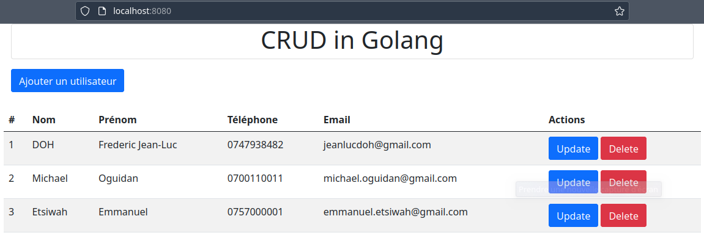

# CRUD IN GOLANG

## Description

Ce projet est une démonstration d'un système CRUD (Create, Read, Update, Delete) développé en utilisant le langage de programmation Go.

Le système permet de gérer une collection d'utilisateurs, en offrant les fonctionnalités suivantes :

- Création d'un nouvel utilisateur avec des informations telles que le nom, le prénom, le téléphone et l'email.
- Affichage de la liste des utilisateurs existants.
- Mise à jour des informations d'un utilisateur existant.
- Suppression d'un utilisateur de la collection.

Le projet est construit en utilisant les principes de base de Go, y compris la gestion des routes HTTP, l'utilisation de templates pour générer des pages HTML et l'interaction avec une base de données.

## Installation

1. Clonez ce dépôt de code :

   git clone https://github.com/freehzaix/crud_golang.git

Accédez au répertoire du projet :

    cd crud-golang

2.Exécutez l'application Go :

    go run main.go

L'application sera accessible à l'adresse http://localhost:8080 dans votre navigateur.

Configuration de la base de données

Le projet utilise une base de données MySQL pour stocker les informations des utilisateurs. Assurez-vous d'avoir une instance MySQL en cours d'exécution et configurez les informations de connexion dans le fichier config.go.
Auteur

Jean-Luc DOH - jeanluc@freehzaix.com